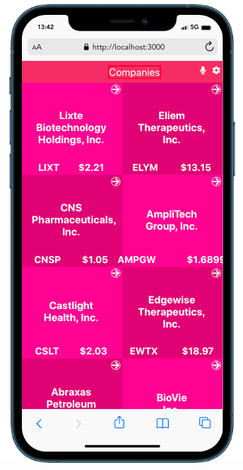

# Financial Modelling prep API - Stock-Data

> Stock-Data web application displays updated data of best perfomrming company stocks. 

Additional description about the project and its features.

## Built With

- HTML5
- CSS3
- React & Redux

## Live Demo

[Live Demo Link](https://practical-carson-f93774.netlify.app/)

## Video Discription

[Video Demo](https://www.loom.com/share/fbde6e76cf004637a0b715ba11797355)

## Getting Started

To get a local copy up and running follow these simple example steps.

- clone: git@github.com:gracekabaghe/stock-data.git
- CD into the project
- npm start

## Authors

👤 **Author1**

- GitHub: [@githubhandle](https://github.com/gracekabaghe)
- LinkedIn: [LinkedIn](https://www.linkedin.com/in/grace-kabaghe/)

## 🤝 Contributing

Contributions, issues, and feature requests are welcome!

Feel free to check the [issues page](../../issues/).

## Show your support

Give a ⭐️ if you like this project!

## Acknowledgments

- Original design idea by Nelson Sakwa on Behance.

## 📝 License

This project is [MIT](./MIT.md) licensed.